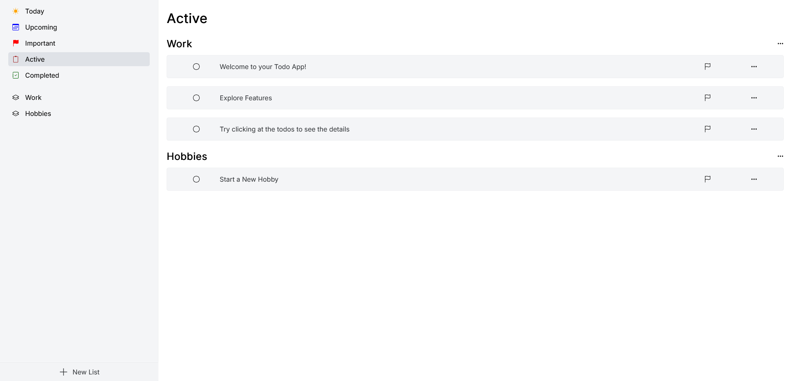

# Todo List

A todo list application built with vanilla JavaScript. This project was created to practice JavaScript fundamentals, DOM manipulation, and modern web development concepts.

## Project Overview

A todo list application where you can:

-   Create multiple lists (like Work, Personal, Shopping)
-   Add, edit, and delete todos
-   Set due dates and priority flags
-   Filter todos by different criteria (Today, Upcoming, Important)
-   Store data in the browser using localStorage

## Technologies Used

-   Vanilla JavaScript (ES6+)
-   HTML & CSS
-   date-fns library for date handling

## Live Demo

[Check out the live demo here!](https://emre-oktay.github.io/todo-list/)

## Screenshot



## Setup & Usage

1. Install dependencies:

```bash
npm install
```

2. Run development server:

```bash
npm run dev
```

-   To reset data:

```javascript
localStorage.removeItem('todoAppLists');
```

## Future Improvements

-   Add drag-and-drop for todos
-   Add search functionality
-   Add sort by date and priority
-   Add dark mode
-   Add exporting/importing data
-   Add responsiveness for smaller devices
